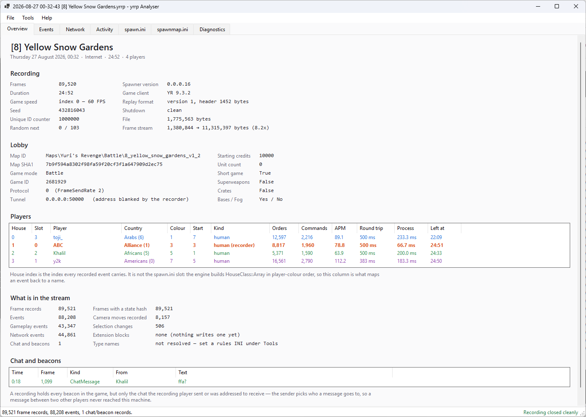
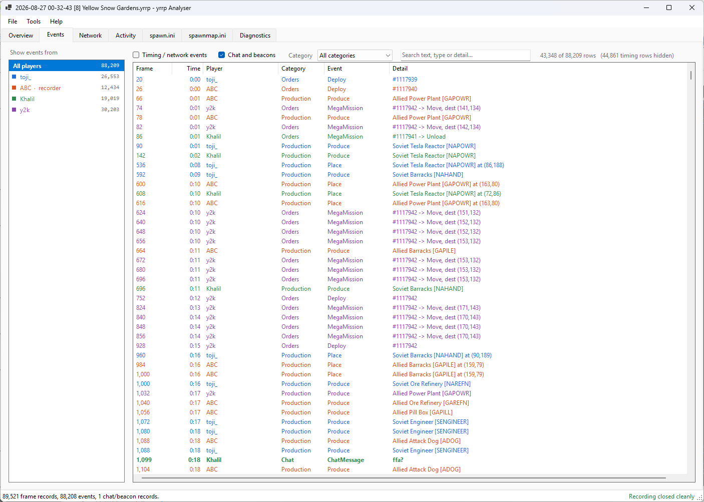
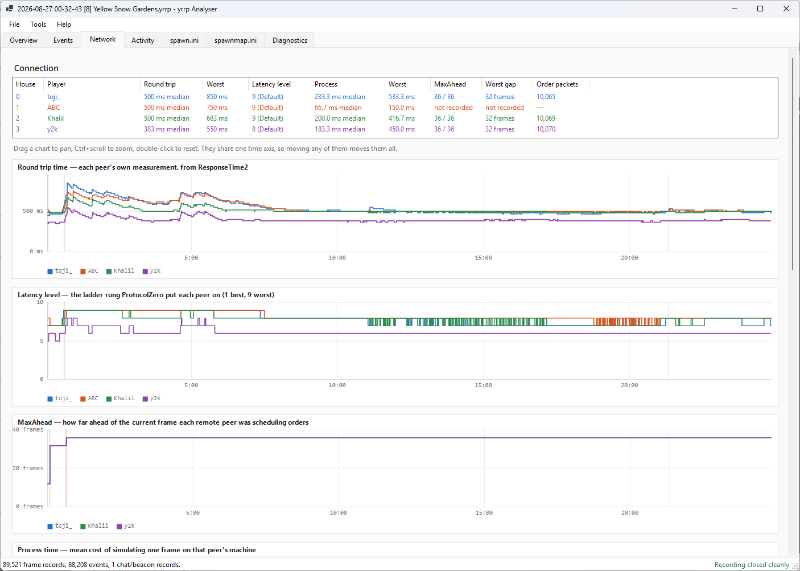
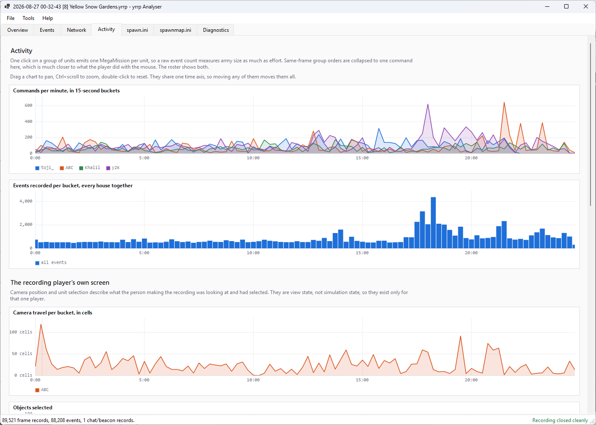
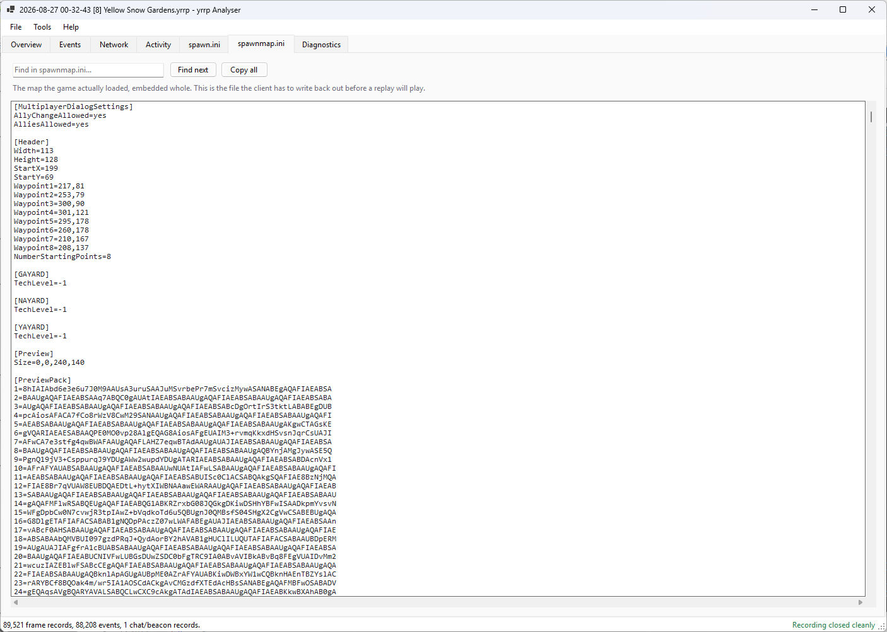
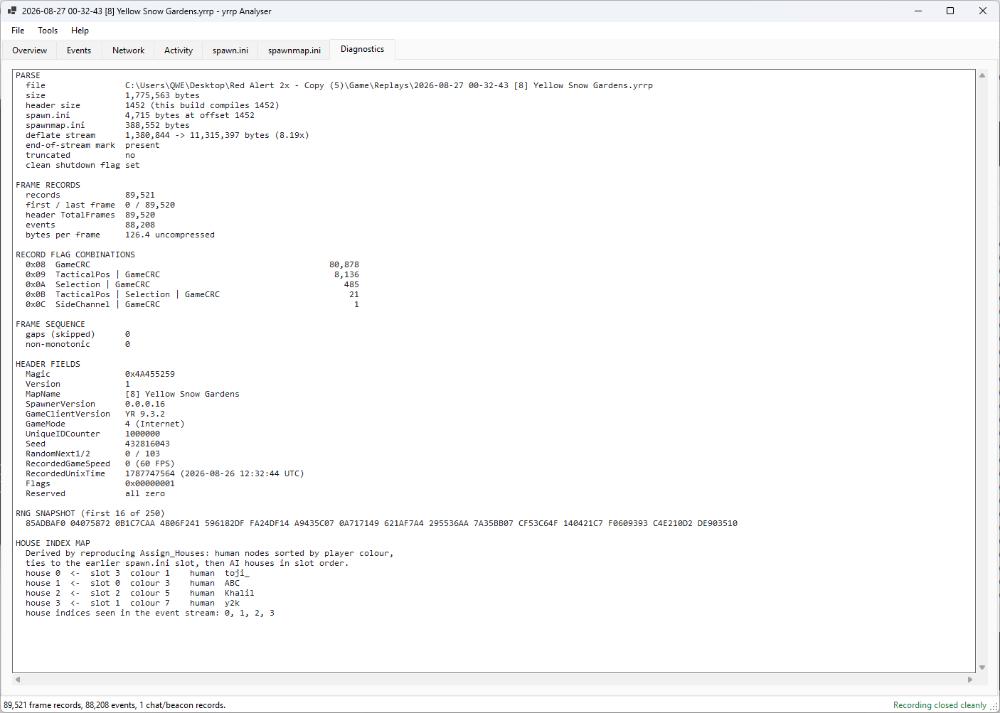

# yrrp Analyser

Reads `.yrrp` replays — the recording format written by the CnCNet [yrpp-spawner](https://github.com/CnCNet/yrpp-spawner)
for Red Alert 2: Yuri's Revenge. It does not play them; it opens one and shows what is actually
inside: who played, what they did, how their connections behaved, and — given both peers'
recordings of one match — the exact frame a desync started on, from either the per-frame state
hash or the object census, whichever moved first.

```
dotnet build
dotnet run --project src/YrrpAnalyser.App -- "path\to\replay.yrrp"
```

.NET 8, no external dependencies. `src/YrrpAnalyser.Core` is the parser and analysis on its own;
`src/YrrpAnalyser.Cli` is a headless `yrrp` command for batch work (`--scan` a folder, `--compare`
two recordings, `--export` every CSV/JSON).

## Overview

Header, lobby and roster. House index is what every recorded event carries, and it is not the
spawn.ini slot — the engine orders `HouseClass::Array` by player colour, which the analyser
reproduces.



## Events

Every event, chat message and beacon on one timeline, with payloads decoded. Pick a player on the
left; timing and network events are hidden by default.

Production events carry a position in the game's type array rather than a name, so point
`Tools > Set rules INIs` at an extracted `rulesmd.ini` and they read as `Soviet Engineer
[SENGINEER]` instead of `InfantryType#27`.



## Network

Per-player round trip, latency level, MaxAhead, process time and order gap, sharing one time axis —
drag any chart to pan and the rest follow, Ctrl+scroll to zoom, double-click to reset. Stalls are
marked in red.

Two caveats, both in the format rather than the tool: the recording player has no MaxAhead line,
because its own `FRAMEINFO` goes straight into the outgoing packet and never reaches the event
queue; and dropped packets and retransmissions are counted below the event queue and are not in a
replay at all. Order gap is the closest proxy the file holds.



## Activity

Commands per minute, event density, the recording player's camera and selection, build order, and
an event breakdown by house.



## spawn.ini and spawnmap.ini

Both embedded files, searchable and exportable. The recorder embeds them verbatim; any address
sanitization is the client's responsibility.



## Diagnostics

Parse results, record-flag histogram, frame-sequence checks, every header field, the game-speed
segments, and the derived house-index map.



## Keeping up with the format

`src/YrrpAnalyser.Core/ReplayFormat.cs` mirrors the spawner's `ReplayFormat.h` by hand, the same
way the CnCNet client's `ReplayGame.cs` does. There is no compile-time link, so a header change has
to be made here too — a size or offset drift is silent, not an error. The spawner's
`docs/replay-format.md` is the reference.

The current reader matches the 1124-byte header and frame block order in spawner commit
`fbf1e04` on `add-replays`. Map names and `GamePackageVersion` come from the embedded
`spawn.ini`; DLL version bytes are no longer recorded. Earlier development headers (1452 or
1128 bytes with metadata inserted before the simulation fields) are not supported. Format version
1 was retained during those development changes.

Frame blocks are read in this order: camera, selection, side channel, CRC, object census, RNG
cursors, game speed, selection triggers, extensions, then gameplay events. Census and RNG blocks
remain readable even though the current recorder no longer emits them. Frame CSV exports include
RNG cursors and selection-trigger IDs; summary JSON keeps INI metadata in its own `metadata` object.

Run the dependency-free binary compatibility checks with:

```
dotnet run --project tests/YrrpAnalyser.CompatibilityTests
```

Fixtures use explicit wire offsets and block flags independently of `ReplayFormat.cs`, including
combined blocks, appended header bytes, empty/campaign recordings, and truncated or invalid records.
